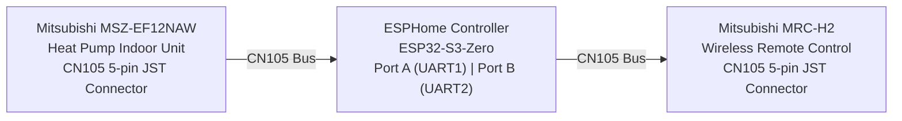

# Glenn Heat Pump — ESPHome CN105 Bridge

## Purpose

This project creates a small ESP32-based device that **inserts itself into the CN105 bus** between a Mitsubishi heat pump indoor unit and the existing wired remote controller. The device acts as a transparent bridge that allows:

- **Home Assistant** (via ESPHome) to monitor and control the heat pump over Wi-Fi.
- **The original wired remote** (Mitsubishi MRC-H2) to continue working normally alongside Home Assistant.

Neither the heat pump nor the remote requires any modification. The ESP32 sits electrically in the middle of the existing cable, connecting to both.

---

## Block Diagram



The ESP32 has two independent UART ports:

| Port | GPIO Pins | Connected To |
|------|-----------|-------------|
| UART1 (`HP_UART`) | TX: GPIO13 / RX: GPIO12 | Heat pump CN105 connector |
| UART2 (`RE_UART`) | TX: GPIO11 / RX: GPIO10 | Remote controller CN105 connector |

Both buses run at 2400 baud, 8 bits, even parity — the standard Mitsubishi CN105 protocol.

---

## Hardware

| Component | Model | Notes |
|-----------|-------|-------|
| Heat Pump | Mitsubishi **MSZ-EF12NAW** | Indoor unit with CN105 5-pin JST connector |
| Remote Controller | Mitsubishi **MRC-H2** | Wired remote; [installation manual](https://www.mitsubishitechinfo.ca/sites/default/files/IM_MHK2_33-00446EFS_B_Rev.%2010_19.pdf) |
| ESP32 Module | Waveshare **ESP32-S3-Zero** | Compact ESP32-S3 board with WS2812 RGB LED; [wiki](https://www.waveshare.com/wiki/ESP32-S3-Zero) |

The ESP32-S3-Zero was chosen for its small footprint and built-in RGB status LED, which is used to indicate Wi-Fi and Home Assistant connection state.

---

## Schematic


The schematic shows how the ESP32-S3-Zero is wired to both CN105 connectors. The 5-pin JST CN105 connector pinout is:

| Pin | Signal |
|-----|--------|
| 1 | +12 V |
| 2 | GND |
| 3 | +5 V |
| 4 | TX (heat pump transmits) |
| 5 | RX (heat pump receives) |

---

## Origin: Fork of MitsubishiCN105ESPHome

This project started as a clone of **[echavet/MitsubishiCN105ESPHome](https://github.com/echavet/MitsubishiCN105ESPHome)**, an ESPHome component that enables full control of a Mitsubishi heat pump through the CN105 serial port using a single ESP32 UART.

The original project supports one-way insertion (ESP32 replaces the remote entirely). This fork adds a **second UART and a heat pump emulator** so that the original wired remote can remain fully functional alongside Home Assistant.

---

## Files Modified / Added

The following files were added or significantly modified relative to the upstream project:

### New Files

| File | Description |
|------|-------------|
| `components/cn105/hp_emulator_idf.cpp` | Core implementation of the **HPEmulator** class. Runs a second UART task that speaks the CN105 protocol *toward* the remote controller, making the ESP32 look like a heat pump to the remote. |
| `components/cn105/hp_emulator_idf.h` | Header for `HPEmulator`. Defines the `HeatpumpState` and `DataBuffer` structs, protocol lookup tables, and the public API used to exchange state with the ESPHome engine. |
| `assets/heatpump-s3-zero.yaml` | Example ESPHome YAML configuration for the ESP32-S3-Zero, with both UARTs configured and the `cn105` platform enabled. |
| `custom_components/mitsubishi_climate_proxy/` | Home Assistant custom component that wraps the ESPHome climate entity to fix a UI issue where dual-setpoint mode causes two temperature sliders to appear in all modes. |

### Modified Files

| File | Change |
|------|--------|
| `components/cn105/cn105.cpp` / `cn105.h` | Added integration hooks so the ESPHome climate engine shares its current state with the `HPEmulator` and accepts state changes pushed by the remote. |

---

## Theory of Operation

### Overview

When the system boots, the ESP32 establishes two independent serial connections:

1. **HP_UART** — communicates with the real Mitsubishi heat pump using the existing CN105 ESPHome driver (`CN105Climate`). This is the unchanged upstream behavior.
2. **RE_UART** — runs the new `HPEmulator`, which speaks the CN105 protocol *toward* the remote controller.

```
Remote  <-->  HPEmulator (RE_UART, UART2)
                    |
              State Sync
                    |
           CN105Climate (HP_UART, UART1)
                    |
            Mitsubishi Heat Pump
```

### HPEmulator (Remote-Side Emulation)

The `HPEmulator` class (in `components/cn105/hp_emulator_idf.cpp`) responds to all CN105 protocol messages that the remote sends, as though the ESP32 *were* the heat pump:

- **Ping/Connect** packets from the remote receive the correct connection acknowledgement.
- **Config request** packets return a valid capability response so the remote knows what modes are supported.
- **Info request** packets return the current heat pump state (temperature, mode, fan speed, vane position) so the remote's display stays accurate.
- **Control** packets (sent when the user presses buttons on the remote) are parsed, translated into ESPHome `wantedHeatpumpSettings`, and forwarded to the `CN105Climate` engine, which then sends them to the real heat pump.

### State Synchronization

Three internal `HeatpumpState` structures are maintained inside `HPEmulator`:

| State | Description |
|-------|-------------|
| `emulatorState` | The state the emulator is currently reporting to the remote |
| `esphomeState` | The latest state read from the ESPHome engine (reflects real HP state) |
| `remoteState` | The last state commanded by the remote |

On every loop cycle, `HPEmulator::updateEmulatorStateFromEngine()` pulls the current actual heat pump state from `CN105Climate` and updates `emulatorState`. This ensures the remote's display always reflects reality, whether the change came from Home Assistant or the remote itself.

When the remote sends a new control command, `HPEmulator::sendEmulatorStateToEngine()` pushes the new desired state into the ESPHome engine, which forwards it to the heat pump.

### Status LED

The onboard WS2812 RGB LED on the ESP32-S3-Zero provides a quick visual status:

| Color | Meaning |
|-------|---------|
| Red | Booting / Wi-Fi not connected |
| Yellow (Red+Green) | Wi-Fi connected, Home Assistant not connected |
| Green | Fully connected to Home Assistant |

### Home Assistant Integration

The ESPHome device exposes a full `climate` entity to Home Assistant, including:
- Mode (Heat, Cool, Dry, Fan Only, Auto)
- Target temperature
- Current room temperature
- Fan speed and vane direction
- Optional diagnostic sensors (compressor frequency, outside air temp, energy usage, runtime hours)

A remote temperature sensor from Home Assistant can be fed back to the heat pump for improved thermostat accuracy.

---

## Example YAML Configuration

The complete ESPHome configuration for the ESP32-S3-Zero is at [assets/heatpump-s3-zero.yaml](assets/heatpump-s3-zero.yaml). Key sections:

```yaml
uart:
  - id: HP_UART        # Connects to the heat pump
    baud_rate: 2400
    parity: even
    tx_pin: GPIO13
    rx_pin: GPIO12
  - id: RE_UART        # Connects to the wired remote
    baud_rate: 2400
    parity: even
    tx_pin: GPIO11
    rx_pin: GPIO10

external_components:
  - source: github://Kirbyrc/Glenn-Heat-Pump
    refresh: 0s

climate:
  - platform: cn105
    id: hp
    uart_id: HP_UART
    name: "My Heatpump S3 Zero"
    ...
```

Copy this file to your ESPHome configuration directory, fill in the `secrets.yaml` values (`wifi_ssid`, `wifi_password`, `ha_encryption_key`, `ota_password`, `recovery_password`), and flash it to your ESP32-S3-Zero.

---

## Disclaimer

This project is not affiliated with or endorsed by Mitsubishi Electric Corporation. Use at your own risk. This is an unofficial implementation based on the reverse-engineered CN105 protocol.
