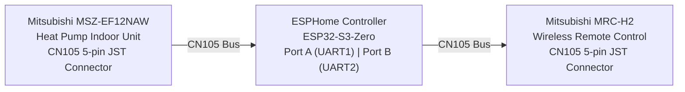
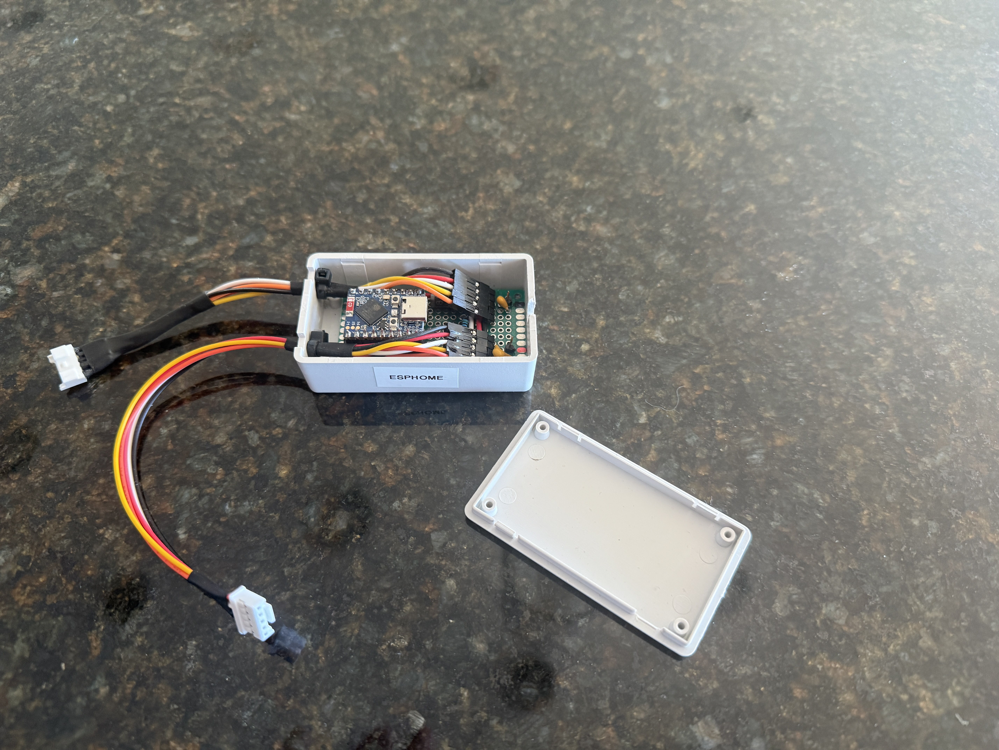
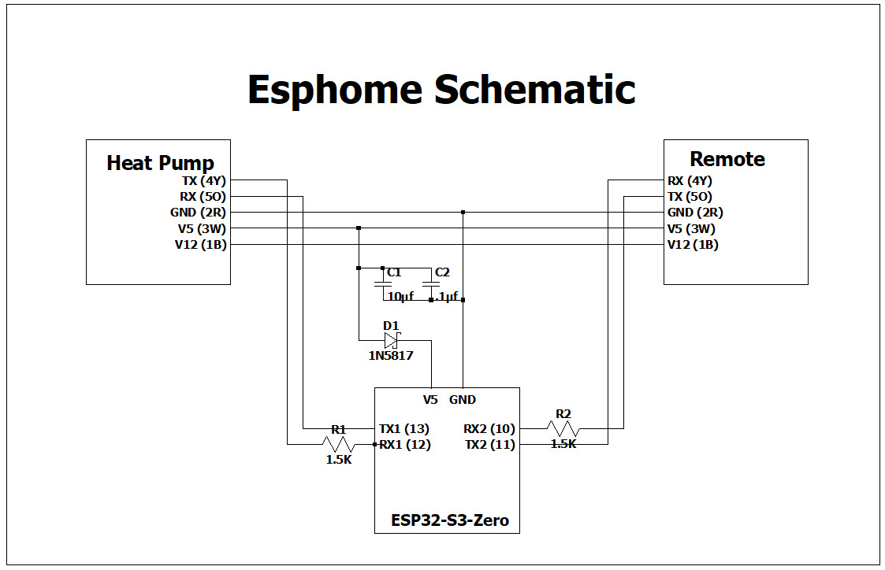

#  MitsubishiCN105ESPHome-Remote — ESPHome CN105 Bridge

## Purpose

This project creates a small ESP32-based device that **inserts itself into the CN105 bus** between a Mitsubishi heat pump indoor unit and the existing wired remote controller. The device acts as a transparent bridge that allows:

- **Home Assistant** (via ESPHome) to monitor and control the heat pump over Wi-Fi.
- **The original wired remote** (Mitsubishi MRC-H2) to continue working normally alongside Home Assistant.

Neither the heat pump nor the remote requires any modification. The ESP32 sits electrically in the middle of the existing cable, connecting to both.

---

## Block Diagram



The ESP32 has two independent UART ports:

| Port | GPIO Pins | Connected To |
|------|-----------|-------------|
| UART1 (`HP_UART`) | TX: GPIO13 / RX: GPIO12 | Heat pump CN105 connector |
| UART2 (`RE_UART`) | TX: GPIO11 / RX: GPIO10 | Remote controller CN105 connector |

Both buses run at 2400 baud, 8 bits, even parity — the standard Mitsubishi CN105 protocol.

---

## Hardware Used

| Component | Model | Notes |
|-----------|-------|-------|
| Heat Pump | Mitsubishi **MSZ-EF12NAW** | Indoor unit with CN105 5-pin JST connector |
| Remote Controller | Mitsubishi **MRC-H2** | Wired remote; [installation manual](https://www.mitsubishitechinfo.ca/sites/default/files/IM_MHK2_33-00446EFS_B_Rev.%2010_19.pdf) |
| ESP32 Module | Waveshare **ESP32-S3-Zero** | Compact ESP32-S3 board with WS2812 RGB LED; [wiki](https://www.waveshare.com/wiki/ESP32-S3-Zero) |

The ESP32-S3-Zero was chosen for its small footprint and built-in RGB status LED, which is used to indicate Wi-Fi and Home Assistant connection state.



---

## Schematic



The schematic shows how the ESP32-S3-Zero is wired to both CN105 connectors. The 5-pin JST CN105 connector pinout is:

| Pin | Signal |
|-----|--------|
| 1 | +12 V |
| 2 | GND |
| 3 | +5 V |
| 4 | TX (heat pump transmits) |
| 5 | RX (heat pump receives) |

---

## Origin: Fork of MitsubishiCN105ESPHome

This project started as a fork of **[echavet/MitsubishiCN105ESPHome](https://github.com/echavet/MitsubishiCN105ESPHome)**, an ESPHome component that enables full control of a Mitsubishi heat pump through the CN105 serial port using a single ESP32 UART.

The original project supports one-way insertion (ESP32 replaces the remote entirely). This fork adds a **second UART and a heat pump emulator** so that the original wired remote can remain fully functional alongside Home Assistant.

---

## Files Modified / Added

The following files were added or significantly modified relative to the upstream project:

### New Files

| File | Description |
|------|-------------|
| `components/cn105/hp_emulator_idf.cpp` | Core implementation of the **HPEmulator** class. Runs a second UART task that speaks the CN105 protocol *toward* the remote controller, making the ESP32 look like a heat pump to the remote. |
| `components/cn105/hp_emulator_idf.h` | Header for `HPEmulator`. Defines the `HeatpumpState` and `DataBuffer` structs, protocol lookup tables, and the public API used to exchange state with the ESPHome engine. |
| `assets/heatpump-s3-zero.yaml` | Example ESPHome YAML configuration for the ESP32-S3-Zero, with both UARTs configured and the `cn105` platform enabled. |

### Modified Files

#### `components/cn105/componentEntries.cpp`

Adds the `HPEmulator` instance and wires it into the ESPHome setup/loop lifecycle:

```diff
 #include "cn105.h"
+#include "hp_emulator_idf.h"
 #ifdef USE_WIFI
 #include "esphome/components/wifi/wifi_component.h"
 #endif

+HVAC::HPEmulator myhp;
+
 void CN105Climate::setup() {

     ESP_LOGD(TAG, "Component initialization: setup call");
@@ -44,6 +48,11 @@ void CN105Climate::setup() {
     this->supports_dual_setpoint_ = this->traits_.has_feature_flags(climate::CLIMATE_REQUIRES_TWO_POINT_TARGET_TEMPERATURE);
     ESP_LOGI(TAG, "Dual setpoint support configured: %s", this->supports_dual_setpoint_ ? "YES" : "NO");

+    g_cn105 = this;  // Set global pointer so HPEmulator can access CN105Climate
+    myhp.setup();
+
 }

 void CN105Climate::loop() {
     const bool can_talk_to_hp = this->isHeatpumpConnected_;

+    myhp.run();
+
     if (!this->processInput()) {
```

#### `components/cn105/cn105.h`

Promotes `currentSettings`, `wantedSettings`, and the `debugSettings` overloads from `private` to `public` so `HPEmulator` can read and write the heat pump state directly:

```diff
-        void publishStateToHA(heatpumpSettings& settings);
         void publishWantedSettingsStateToHA();
         void publishWantedRunStatesStateToHA();

-        void heatpumpUpdate(heatpumpSettings& settings);
+        void publishStateToHA(heatpumpSettings& settings);

         void statusChanged(heatpumpStatus status);

-        void debugSettings(const char* settingName, heatpumpSettings& settings);
-        void debugSettings(const char* settingName, wantedHeatpumpSettings& settings);
+
         void debugStatus(const char* statusName, heatpumpStatus status);

         void createInfoPacket(uint8_t* packet, uint8_t code);
+
+    public:
+        // Made public for HPEmulator access
         heatpumpSettings currentSettings{};
         wantedHeatpumpSettings wantedSettings{};
+        void debugSettings(const char* settingName, heatpumpSettings& settings);
+        void debugSettings(const char* settingName, wantedHeatpumpSettings& settings);
+
+    private:
+        void heatpumpUpdate(heatpumpSettings& settings);
         heatpumpRunStates currentRunStates{};
```

---

## Theory of Operation

### Overview

When the system boots, the ESP32 establishes two independent serial connections:

1. **HP_UART** — communicates with the real Mitsubishi heat pump using the existing CN105 ESPHome driver (`CN105Climate`). This is the unchanged upstream behavior.
2. **RE_UART** — runs the new `HPEmulator`, which speaks the CN105 protocol *toward* the remote controller.

```
Remote  <-->  HPEmulator (RE_UART, UART2)
                    |
              State Sync
                    |
           CN105Climate (HP_UART, UART1)
                    |
            Mitsubishi Heat Pump
```

### HPEmulator (Remote-Side Emulation)

For the remote to work, it needs to believe that it is talking directly to the heatpump.  To enable this, the code contains an emulator that has the purpose of keeping the remote happy.   The `HPEmulator` class (in `components/cn105/hp_emulator_idf.cpp`) responds to all CN105 protocol messages that the remote sends, as though the ESP32 *were* the heat pump:

- **Ping/Connect** packets from the remote receive the correct connection acknowledgement.
- **Config request** packets return a valid capability response so the remote knows what modes are supported.
- **Info request** packets return the current heat pump state (temperature, mode, fan speed, vane position) so the remote's display stays accurate.
- **Control** packets (sent when the user presses buttons on the remote) are parsed, translated into ESPHome `wantedHeatpumpSettings`, and forwarded to the `CN105Climate` engine, which then sends them to the real heat pump.

### State Synchronization

Three internal `HeatpumpState` structures are maintained inside `HPEmulator`:

| State | Description |
|-------|-------------|
| `emulatorState` | The state the emulator is currently reporting to the remote |
| `esphomeState` | The latest state read from the ESPHome engine (reflects real HP state) |
| `remoteState` | The last state commanded by the remote |

On every second, `HPEmulator::updateEmulatorStateFromEngine()` pulls the current actual heat pump state from `CN105Climate` and updates `emulatorState`. This ensures the remote's display always reflects reality, whether the change came from Home Assistant or the remote itself.

When the remote sends a new control command, `HPEmulator::sendEmulatorStateToEngine()` pushes the new desired state into the ESPHome engine, which forwards it to the heat pump.  Once the remote pushes it state, it will disable for 30 seconds to allow this state to propagate throught the system. Without this lockout, the system will oscillate between various states.

### Optional Web Interface

To enable debugging, the emulator has the ability to provide a second web inteface running on WEBPORT.  ESPHOME provides a web interface running on port 80.   This interface will display the esphome state and the remote state.

### Kludge for second Serial Port

The second Serial port is defined in the yaml file.  This second port is not supported in the climate.py code so an alternative method to bring the port information into the emulator was needed.   This is accomplished through use of the g_re_uart variable which is set in the on_boot section of the yaml code.

### Status LED

The onboard WS2812 RGB LED on the ESP32-S3-Zero provides a quick visual status:

| Color | Meaning |
|-------|---------|
| Red | Booting / Wi-Fi not connected |
| Yellow (Red+Green) | Wi-Fi connected, Home Assistant not connected |
| Green | Fully connected to Home Assistant |

### Home Assistant Integration

The ESPHome device exposes a full `climate` entity to Home Assistant, including:
- Mode (Heat, Cool, Dry, Fan Only, Auto)
- Target temperature
- Current room temperature
- Fan speed and vane direction
- Optional diagnostic sensors (compressor frequency, outside air temp, energy usage, runtime hours)

A remote temperature sensor from Home Assistant can be fed back to the heat pump for improved thermostat accuracy.

---

## Example YAML Configuration

The complete ESPHome configuration for the ESP32-S3-Zero is at [assets/heatpump-s3-zero.yaml](assets/heatpump-s3-zero.yaml).

Copy this file to your ESPHome configuration directory, fill in the `secrets.yaml` values (`wifi_ssid`, `wifi_password`, `ha_encryption_key`, `ota_password`, `recovery_password`), and flash it to your ESP32-S3-Zero.

```yaml
substitutions:
  name: heatpump-s3-zero
  friendly_name: My Heatpump S3 Zero
  remote_temp_sensor: sensor.my_room_temperature # Homeassistant sensor providing remote temperature

esphome:
  name: ${name}
  friendly_name: ${friendly_name}
  on_boot:
    priority: 600 # High priority runs early in the boot process
    then:
      - lambda: |- #this lambda is used to connect the remote uart to RE_UART.  This is necessary unless Climate.py is changed
          extern esphome::uart::IDFUARTComponent* g_re_uart;
          g_re_uart = id(RE_UART);
      - light.turn_on:
          id: statusledlight
          red: 100%
          green: 0%
          blue: 0%
          brightness: 40%
  platformio_options:
    build_flags:
      -DBOARD_HAS_PSRAM
      -DWEBPORT=8080 #optional, starts a debug web interface on port 8080
    board_build.arduino.memory_type: qio_opi
    board_build.flash_mode: qio
    board_build.psram_type: qio
    board_upload.maximum_size: 4194304

esp32:
#  board: esp32doit-devkit-v1
#  framework:
#    type: esp-idf
  board: esp32-s3-devkitc-1
  variant: esp32s3
  flash_size: 4MB
  framework:
    type: esp-idf

uart:
  - id: HP_UART
    baud_rate: 2400
    parity: even
    tx_pin: GPIO13
    rx_pin: GPIO12
  - id: RE_UART
    baud_rate: 2400
    parity: even
    tx_pin: GPIO11
    rx_pin: GPIO10

external_components:
  - source: github://Kirbyrc/MitsubishiCN105ESPHome-Remote
    refresh: 0s

#status LED
light:
  - platform: esp32_rmt_led_strip
    rgb_order: RGB
    pin: GPIO21
    num_leds: 1
    chipset: ws2812
    name: Status LED Light
    id: statusledlight
    restore_mode: ALWAYS_ON

# Enable WiFi connection
wifi:
  output_power: 8.5
  ssid: !secret wifi_ssid
  password: !secret wifi_password
  on_connect:
    then:
      - light.turn_on:
          id: statusledlight
          red: 50%
          green: 50%
          blue: 0%
          brightness: 40%

  # Enable fallback hotspot (captive portal) in case wifi connection fails
  ap:
    ssid: "${friendly_name} ESP"
    password: !secret recovery_password

captive_portal:

# Enable logging
logger:
  logs:
    EVT_SETS : INFO
    WIFI : INFO
    MQTT : INFO
    WRITE_SETTINGS : INFO
    SETTINGS : INFO
    STATUS : INFO
    CN105Climate: WARN
    CN105: INFO
    climate: WARN
    sensor: WARN
    chkSum : INFO
    WRITE : WARN
    READ : WARN
    Header: INFO
    Decoder : INFO
    CONTROL_WANTED_SETTINGS: INFO
    HPE_Core : WARN  # new logging for the Heatpump Emulator messages

# Enable Home Assistant API
api:
  encryption:
    key: !secret ha_encryption_key
  on_client_connected:
    then:
      - light.turn_on:
          id: statusledlight
          red: 0%
          green: 100%
          blue: 0%
          brightness: 40%

  on_client_disconnected:
    then:
      - light.turn_on:
          id: statusledlight
          red: 100%
          green: 0%
          blue: 0%
          brightness: 40%

ota:
  password: !secret ota_password
  platform: esphome

sensor:
  - platform: uptime
    name: Uptime
  - platform: wifi_signal
    name: WiFi Signal
    update_interval: 120s
  - platform: homeassistant
    name: "Remote Temperature Sensor"
    entity_id: ${remote_temp_sensor} # Replace with your HomeAssistant remote sensor entity id, or include in substitutions
    internal: false
    disabled_by_default: true
    device_class: temperature
    state_class: measurement
    unit_of_measurement: "°C"
    filters:
    # Uncomment the lambda line to convert F to C on incoming temperature
    #  - lambda: return (x - 32) * (5.0/9.0);
      - clamp: # Limits values to range accepted by Mitsubishi units
          min_value: 1
          max_value: 40
          ignore_out_of_range: true
      - throttle: 30s
    on_value:
      then:
        - logger.log:
            level: INFO
            format: "Remote temperature received from HA: %.1f C"
            args: [ 'x' ]
        - lambda: 'id(hp).set_remote_temperature(x);'

# Enable Web server.
web_server:
  port: 80

# Sync time with Home Assistant.
time:
  - platform: homeassistant
    id: homeassistant_time

# Text sensors with general information.
text_sensor:
  - platform: version
    name: ESPHome Version
  - platform: wifi_info
    ip_address:
      name: IP
    ssid:
      name: SSID
    bssid:
      name: BSSID

# Create a button to restart the unit from HomeAssistant. Rarely needed, but can be handy.
button:
  - platform: restart
    name: "Restart ${friendly_name}"

# Creates the sensor used to receive the remote temperature from Home Assistant
# Uses sensor selected in substitutions area at top of config
# Customize the filters to your application:
#   Uncomment the first line to convert F to C when remote temps are sent
#   If you have a fast or noisy sensor, consider some of the other filter
#   options such as throttle_average.
climate:
  - platform: cn105
    id: hp
    uart_id: HP_UART
    name: "${friendly_name}"
    icon: mdi:heat-pump
    visual:
      min_temperature: 15
      max_temperature: 31
      temperature_step:
        target_temperature: 1
        current_temperature: 0.5
    # Timeout and communication settings
    remote_temperature_timeout: 30min
    update_interval: 4s
    debounce_delay : 100ms
    # Various optional sensors, not all sensors are supported by all heatpumps
    compressor_frequency_sensor:
      name: Compressor Frequency
      entity_category: diagnostic
      disabled_by_default: true
    outside_air_temperature_sensor:
      name: Outside Air Temp
      disabled_by_default: true
    vertical_vane_select:
      name: Vertical Vane
      disabled_by_default: false
    horizontal_vane_select:
      name: Horizontal Vane
      disabled_by_default: true
    isee_sensor:
      name: ISEE Sensor
      disabled_by_default: true
    stage_sensor:
      name: Stage
      entity_category: diagnostic
      disabled_by_default: true
    sub_mode_sensor:
      name: Sub Mode
      entity_category: diagnostic
      disabled_by_default: true
    auto_sub_mode_sensor:
      name: Auto Sub Mode
      entity_category: diagnostic
      disabled_by_default: true
    input_power_sensor:
      name: Input Power
      disabled_by_default: true
    kwh_sensor:
      name: Energy Usage
      disabled_by_default: true
    runtime_hours_sensor:
      name: Runtime Hours
      entity_category: diagnostic
      disabled_by_default: true
```

---

## Disclaimer

This project is not affiliated with or endorsed by Mitsubishi Electric Corporation. Use at your own risk. This is an unofficial implementation based on the reverse-engineered CN105 protocol.
